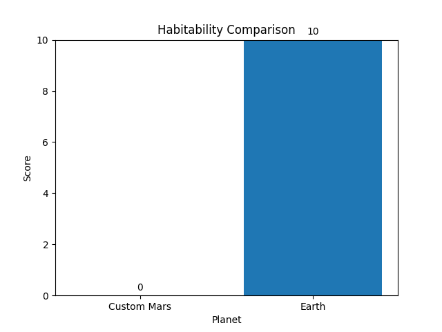
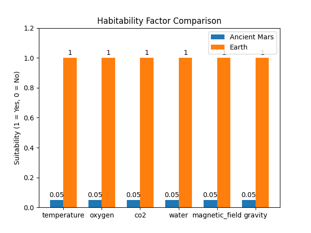
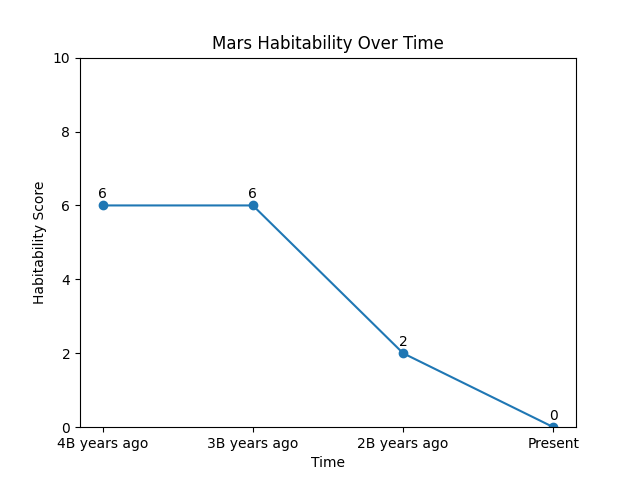

# 🌌 Are We From Mars?


---

## 🧠 Overview
This project explores a conceptual scientific hypothesis:

> Could life have originated on Mars and later migrated to Earth?

Using a computational simulation, this project models planetary habitability and evaluates the plausibility of interplanetary life transfer based on environmental conditions.

---

## 🚀 Features
- 🌍 Compare **Earth, Present Mars, and Ancient Mars**
- 🧪 Weighted habitability scoring system
- 🔬 Migration hypothesis analysis
- 🎛️ Interactive simulation (user-defined conditions)
- 📊 Data visualization:
  - Habitability score comparison
  - Factor-level breakdown
  - Time evolution of Mars
- 🎯 Probability-based life estimation model

---

## 🧬 Parameters Considered
- 🌡️ Temperature  
- 🌬️ Oxygen levels  
- ⚖️ CO₂ levels (optimal range-based)  
- 💧 Water availability  
- 🧲 Magnetic field strength  
- 🌍 Gravity  

---

## 📊 Example Output

### Habitability Comparison


### Factor Breakdown


### Mars Habitability Evolution


---

## 🔬 Model Architecture

The project progresses through multiple modeling stages:

1. **Rule-Based Model**  
   Basic condition checks for habitability

2. **Weighted Model**  
   Assigns importance to different planetary factors

3. **Normalized Model**  
   Converts scores into percentages

4. **Probabilistic Model**  
   Estimates likelihood of life (0–1 scale)

---

## ⚠️ Scientific Note
This project uses simplified and estimated parameters for Ancient Mars based on current scientific understanding.

It is a **conceptual and exploratory simulation**, designed to investigate hypotheses about planetary habitability and potential life migration — not to provide definitive scientific conclusions.

---

## 🛠️ Tech Stack
- Python 🐍  
- Matplotlib 📊  
- Numpy 🔢

---

## ▶️ How to Run

```bash
git clone https://github.com/Tejashwita-18/Mars_project.git
cd Mars_project/src
python main.py
```

## 🚀 Future Improvements

This project is actively evolving, with planned improvements to enhance scientific accuracy and usability:

- 🌌 **Time-Based Planetary Evolution Modeling**  
  Extend the current model to simulate long-term planetary changes (e.g., Mars transitioning from a warm, wet environment to its present state).

- 📡 **Integration with Real Space Data (NASA APIs)**  
  Incorporate real planetary datasets from organizations like NASA to improve accuracy and make the simulation data-driven.

- 🌐 **Web-Based Interactive Interface (Streamlit)**  
  Transform the simulation into an interactive web application with sliders and controls for real-time experimentation.

- 📊 **Advanced Visualization Dashboard**  
  Develop richer visualizations such as timelines, comparative charts, and dynamic graphs for deeper insights.

- 🧪 **Enhanced Scientific Modeling Techniques**  
  Improve the model using weighted, probabilistic, and potentially machine learning-based approaches for more realistic habitability predictions.

---

## ✨ Inspiration
This project is inspired by curiosity about space, planetary science, and the possibility that life may have origins beyond Earth.

---

## 👩‍💻 Author
**Tejashwita Priya**

---

## 🌟 Support
If you found this project interesting:
- ⭐ Star the repository  
- 🍴 Fork it and experiment  
- 💬 Share feedback or suggestions
